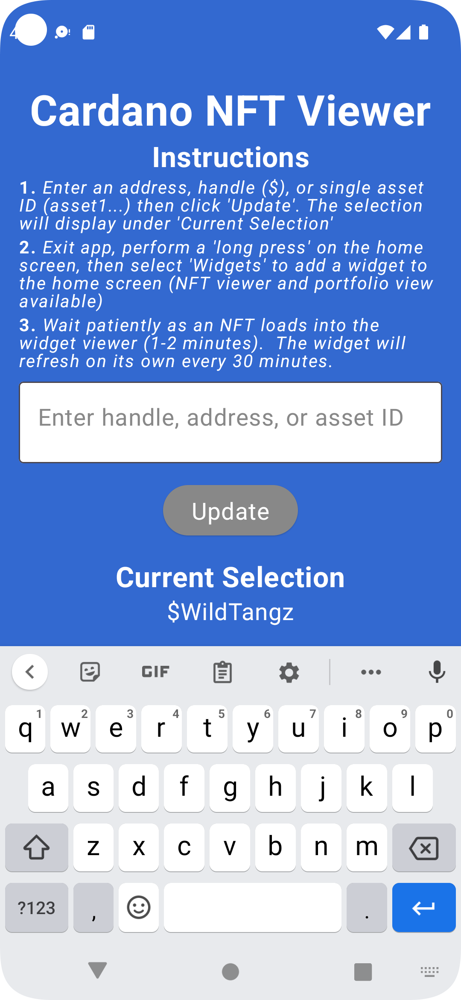
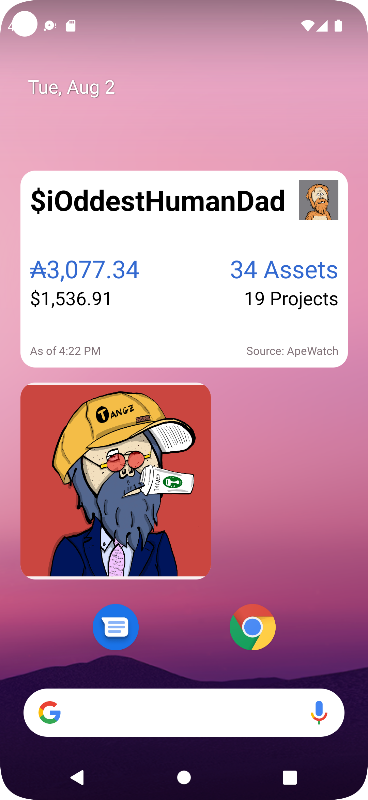

# 📱 Mobile App with Widgets


#### Holding Requirements

_NFT Viewer Widget -> 1 Wild Tangz_

_Portfolio Viewer Widget (powered by ApeWatch) -> 3 Wild Tangz_


This is a mobile app to place a single CNFT or a wallet/handle/address collection onto your mobile phone via a phone widget. You first enter the wallet/handle/address/asset you would like to see in the app, then add a home screen widget on iOS or Android.

In addition, a second widget allows you to view your estimated portfolio valuation (courtesy of our friends at [ApeWatch](https://apewatch.app/) \[thanks [@Victor Mundi](https://twitter.com/victormundi)!]). _NOTE: Portfolio valuation is an estimate based on marketplace listing and does not represent or warrant actual valuations or financial advice_

**iOS**: [https://apps.apple.com/us/app/cardano-nfts/id1635181620](https://apps.apple.com/us/app/cardano-nfts/id1635181620)

<figure><figcaption></figcaption></figure>

 

<figure><figcaption></figcaption></figure>

 

<figure><figcaption></figcaption></figure>

 

<figure><figcaption></figcaption></figure>

**Android**: [https://play.google.com/store/apps/details?id=com.wildtangz.cardano.nft](https://play.google.com/store/apps/details?id=com.wildtangz.cardano.nft)

<figure><figcaption></figcaption></figure>

 

<figure><figcaption></figcaption></figure>

 

<figure><figcaption></figcaption></figure>

**Status**: Generally Available

**Codebase**: [https://github.com/thaddeusdiamond/cardano-nft-mobile-widgets](https://github.com/thaddeusdiamond/cardano-nft-mobile-widgets)
